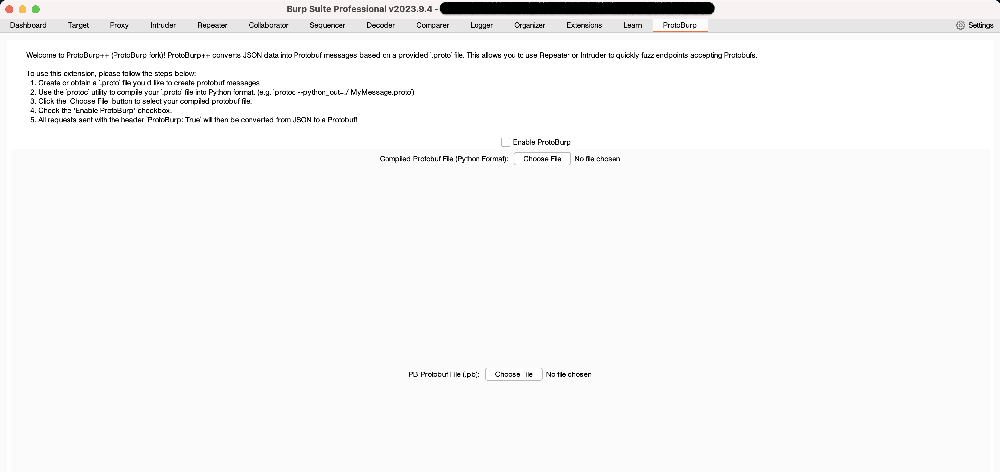

# ProtoBurp++

This is an updated version of [ProtoBurp by Dillon Franke](https://dillonfrankesecurity.com/posts/protoburp-encode-custom-protobuf-messages-in-burp/), with enhanced features and capabilities. We called this version **ProtoBurp++** to distinguish the tool from the original project.

## Description
`ProtoBurp++` is a Burp Suite extension that enables security researchers to encode/decode and fuzz custom Protobuf messages. It allows users to automatically convert JSON data into a Protobuf message based on a provided protobuf definition file. This opens up opportunities for fuzzing inputs using Burp's Repeater, Intruder tools and Active Scanner, as well as proxy traffic from other tools (e.g. `sqlmap`).

> LIMITATION 1: general protobuf support is work in progress, currently protobuf gRPC is the only fully supported!

> LIMITATION 2: compression support is a work in progress.

## New Features

- **Dedicated Tab**: Automatic decoding of proto messages in proxy/repeater.
- **Automatic Serialization**: Messages edited using the decode tab are automatically serialized.
- **Enhanced Encoding & Decoding**: Automatic encoding and decoding for requests containing the "Protoburp" header, facilitating the use of Intruder and Active Scanner.
- **Protobuf Message Extractor**: Extracts protobuf messages from compiled descriptors.

## Old Features

- **Auto-Encoding in Intruder**: Automatically encodes requests containing the "Protoburp" header for use in the intruder.
- **Python Support**: Offers support for compiled python definitions of protobuf.

## Installation

### 1. Clone the `ProtoBurp` repository and its submodules
```bash
git clone https://github.com/dillonfranke/protoburp.git
```

### 2. Install the `protoc` utility, which you'll need to compile Protobuf defintion (`.proto`) files
Mac:
```bash
brew install protobuf
```
Debian Linux:
```bash
sudo apt-get update
sudo apt-get install protobuf-compiler
```
Windows:
https://github.com/protocolbuffers/protobuf/releases

### 3. Install python3 lib
```bash
pip3 install protobuf
```


## Usage

### 1.1 Compile the `.proto` file you want to convert into Python format
> Several example `.proto` files are contained in the `test_app` folder
```bash
protoc --python_out=. addressbook.proto
```

### 1.2 Compile the `.proto` file you want into descriptor
How to ensure all dependencies and .proto files are embedded in one file: `protoc [...] --include_source_info --include_imports --descriptor_set_out=descriptor.pb $(PROTO_FILES)`, [...] means whatever option you were using before, PROTO_FILES is the list of all the .proto files. This way, you get a single pb file containing all the compiled .proto and their dependencies, which is really convenient for not having to change files constantly.

### 2. Load the `ProtoBurp` extension and select your compiled `.proto` file


- Click 'Enable ProtoBurp'
- Select the Python Protobuf definition file you just compiled or the descriptor



### 3. Set the `ProtoBurp` header on your requests, and your requests will be transformed from JSON to Protobuf!
Use this to work with Intruder and Active Scanner.


### Generating a JSON payload
You might be wondering: "How can I generate a JSON object from a `.proto` file to use with `ProtoBurp`?"

Easy, I wrote a script that, given a `.proto` file, will fill in placeholder values to generate a JSON payload. You can then use the JSON payload with `ProtoBurp`. Here's how you use the script:

```bash
❯ python3 json-generator.py
Usage: python3 json-generator.py <compiled_proto_definition_pb2.py> <MessageName>
```
```bash
❯ python3 json-generator.py test_app/addressbook_pb2.py AddressBook
{
  "people": [
    {
      "name": "example",
      "id": 1,
      "email": "example",
      "phones": [
        {
          "number": "example",
          "type": "PHONE_TYPE_UNSPECIFIED"
        },
        {
          "number": "example",
          "type": "PHONE_TYPE_UNSPECIFIED"
        }
      ]
    },
    {
      "name": "example",
      "id": 1,
      "email": "example",
      "phones": [
        {
          "number": "example",
          "type": "PHONE_TYPE_UNSPECIFIED"
        },
        {
          "number": "example",
          "type": "PHONE_TYPE_UNSPECIFIED"
        }
      ]
    }
  ]
}
```

## Use Cases
Please see my [blog post](https://dillonfrankesecurity.com/posts/protoburp-encode-custom-protobuf-messages-in-burp/), where I talk about how you can use `ProtoBurp` with Repeater, Intruder, and external security utilities like `sqlmap`!

## Bugs and Feature Requests
Please use the [issues tab](https://github.com/dillonfranke/protoburp/issues) for any bugs or feature requests.

---

## Maintainers & Contributors

### Maintainers

- **zi0Black** 
  - Affiliation: Aptos Labs; former researcher at ShielderSec
  - [GitHub Profile](https://github.com/zi0Black)

- **phosphore** 
  - Affiliation: Doyensec
  - [GitHub Profile](https://github.com/phosphore)

### Contributors

- **Federico Dotta**
  - Thanks for sharing your knowledge about the obscure Java/Python API of Burp Suite
  - Contribute to the code
  - [GitHub Profile](https://github.com/federicodotta)

- **Dillon Franke**
  - Original concept & development
  - [Github Profile](https://github.com/dillonfranke)
  
---

ProtoBurp++ was made possible and sponsored by [Doyensec LLC](https://www.doyensec.com). 


[Engage us to break](https://doyensec.com/auditing.html) your Protocol Buffers-based application!
